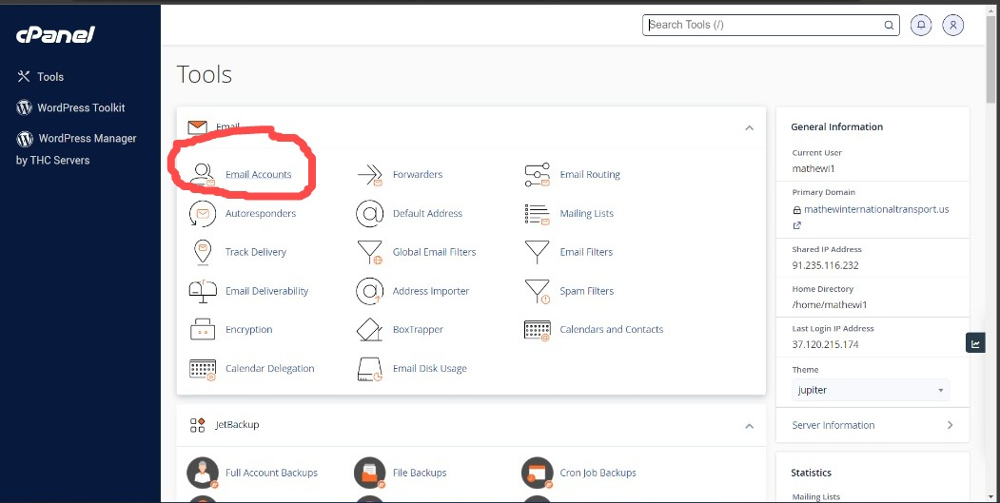
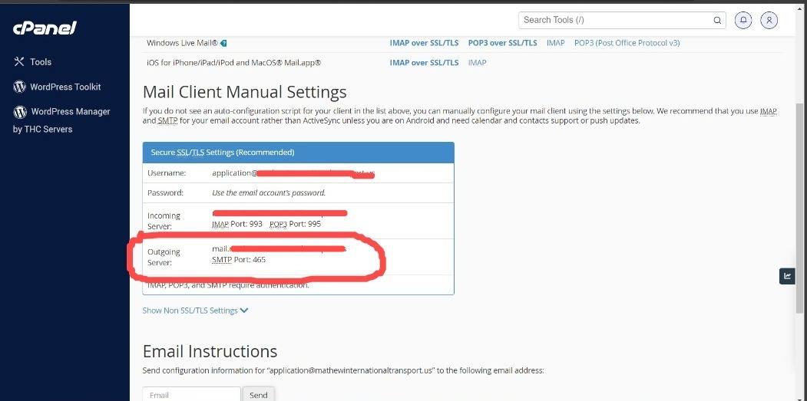

## PHP mailer/form submission

**how to send mail from your website** and **how to submit form using php**

*   [x] create a form.php never mind you don't need to study a new language
*   [x] in your html file where u have your form set your method as you desire
*   [x] add  enctype="multipart/form-data" in ur form tag as it is required in form submission with files
*   [x] create your input fields and add name accordingly
*   [x] example, input type="text" name="message"...
*   [x] Set your form method to form.php
*   [x] create form.php file
*   [x] open PHP as required in writing PHP code 

```plaintext
<?php
...
?>
```

*   [x] create variables gotten from the html form

```css
$name = $_POST['name'];

$email = $_POST['email'];

$message = $_POST['message'];


// get the file attr
$file_upload_tmp = $_FILES['resume']['tmp_name']; //the file tmp name
$file_upload_name     = $_FILES['resume']['name']; //the file name
$file_upload_size     = $_FILES['resume']['size']; //the file size
$file_upload_type     = $_FILES['resume']['type']; //the file type
$file_upload_error     = $_FILES['resume']['error']; //check if erro

if($file_upload_error > 0)
{
    die('Upload error or No files uploaded'); //stop uploading and display this like p tag
}

$file_upload_handle = fopen($file_upload_tmp, "r"); //open file to read mode
$file_upload_content = fread($file_upload_handle, $file_upload_size); //get the file content from what u read and its size
fclose($file_upload_handle); //close the file
$file_upload_encoded_content = chunk_split(base64_encode($file_upload_content)); //encode the file

$boundary = md5("random");
```

*   [x] Let's define the mailing variable

```plaintext

$from = "application@mydomainname.com"; //the mail u will be using to send the form
$to = "yourmailer@example.com"; //the mail you will be using to recieve


$subject = "Mail Submission with PHP (BlackStackHub)"; //subject
$message = "
My Name is $name


$comment


Reply to  $email now!
"; // the message


//the mail header
$headers = "MIME-Version: 1.0\r\n";
$headers .= "From:".$from."\r\n";
$headers .= "Reply-To: ".$to."\r\n";
$headers .= "Content-Type: multipart/mixed;";
$headers .= "boundary = $boundary\r\n";

//the message
$body = "--$boundary\r\n";
$body .= "Content-Type: text/plain; charset=ISO-8859-1\r\n";
$body .= "Content-Transfer-Encoding: base64\r\n\r\n";
$body .= chunk_split(base64_encode($message));

//the file added
$body .= "--$boundary\r\n";
$body .="Content-Type: $file_upload_type; name=".$file_upload_name."\r\n";
$body .="Content-Disposition: attachment; filename=".$file_upload_name."\r\n";
$body .="Content-Transfer-Encoding: base64\r\n";
$body .="X-Attachment-Id: ".rand(1000, 99999)."\r\n\r\n";
$body .= $file_upload_encoded_content;
```

*   [x] configuration

*   Login to your panel admin and follow as described in the image.





```plaintext

//this should be init i.e at the top of ur codes

ini_set('SMTP', "mail.mydomainname.com"); 
ini_set('smtp_port', "XXX");
ini_set('sendmail_from', "application@mydomainname.com");

error_reporting( E_ALL ); //getting logs
```

12\. submitting the form

```plaintext

mail($to, $subject, $body, $headers);
echo "Your Message Has Been Sent Successfully";
echo "Thank You";
```

### Complete Code

```plaintext
<?php
//this should be init i.e at the top of ur codes

ini_set('SMTP', "mail.mydomainname.com"); 
ini_set('smtp_port', "XXX");
ini_set('sendmail_from', "application@mydomainname.com");

error_reporting( E_ALL ); //getting logs

$name = $_POST['name'];

$email = $_POST['email'];

$message = $_POST['message'];


// get the file attr
$file_upload_tmp = $_FILES['resume']['tmp_name']; //the file tmp name
$file_upload_name     = $_FILES['resume']['name']; //the file name
$file_upload_size     = $_FILES['resume']['size']; //the file size
$file_upload_type     = $_FILES['resume']['type']; //the file type
$file_upload_error     = $_FILES['resume']['error']; //check if erro

if($file_upload_error > 0)
{
    die('Upload error or No files uploaded'); //stop uploading and display this like p tag
}

$file_upload_handle = fopen($file_upload_tmp, "r"); //open file to read mode
$file_upload_content = fread($file_upload_handle, $file_upload_size); //get the file content from what u read and its size
fclose($file_upload_handle); //close the file
$file_upload_encoded_content = chunk_split(base64_encode($file_upload_content)); //encode the file

$boundary = md5("random");


$from = "application@mydomainname.com"; //the mail u will be using to send the form
$to = "yourmailer@example.com"; //the mail you will be using to recieve


$subject = "Mail Submission with PHP (BlackStackHub)"; //subject
$message = "
My Name is $name


$comment


Reply to  $email now!
"; // the message


//the mail header
$headers = "MIME-Version: 1.0\r\n";
$headers .= "From:".$from."\r\n";
$headers .= "Reply-To: ".$to."\r\n";
$headers .= "Content-Type: multipart/mixed;";
$headers .= "boundary = $boundary\r\n";

//the message
$body = "--$boundary\r\n";
$body .= "Content-Type: text/plain; charset=ISO-8859-1\r\n";
$body .= "Content-Transfer-Encoding: base64\r\n\r\n";
$body .= chunk_split(base64_encode($message));

//the file added
$body .= "--$boundary\r\n";
$body .="Content-Type: $file_upload_type; name=".$file_upload_name."\r\n";
$body .="Content-Disposition: attachment; filename=".$file_upload_name."\r\n";
$body .="Content-Transfer-Encoding: base64\r\n";
$body .="X-Attachment-Id: ".rand(1000, 99999)."\r\n\r\n";
$body .= $file_upload_encoded_content;

mail($to, $subject, $body, $headers);
echo "Your Message Has Been Sent Successfully";
echo "Thank You";
?>
```

#### If mail is successfully sent, you will see the message **“Your Message Has Been Sent Successfully”**, else read again.